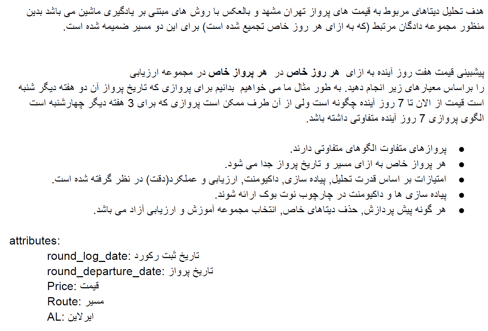

# Alibaba AI Task   


This repository contains my solution to an AI task by [Alibaba.ir](https://www.alibaba.ir/).
The model is called APO: Alibaba Price Oracle.

Given a dataset of flight prices predict future price of 7 days.

## Main Idea
The model prediction is conditioned on the price history. The time frame is considered to be a week; i.e. 7 days.
We theorise that flight price dynamics have airline and market influencing factors.
Airline factors, constitute individual business model, airline assets, demand, etc.
Market is made up of a collection of airlines offering a service on the same route, that creates the supply.
For simplification, we do not differentiate between in-/out-bound flights.

We bring in these ideas into the network architecture by self-attention mechanism.

## Installation

APO is originally developed for Python 3.7, PyTorch 1.8.2 LTS, for Ubuntu 20.04.2 LTS. 
Below we prepare the python environment using [Anaconda](https://www.anaconda.com/products/individual), 
however, we opt for a simple pip package manager for installing dependencies.

````
conda create -n apo python=3.7 
conda activate apo

pip3 install torch==1.8.2+cu102 torchvision==0.9.2+cu102 torchaudio==0.8.2 -f https://download.pytorch.org/whl/lts/1.8/torch_lts.html
pip install -r requirements.txt
````
Download pretrained models from [here](https://www.dropbox.com/s/fz12plypvktedgu/alibaba_ai_task.zip?dl=0).
## Tutorials
For scripts on data preprocessing, training and testing APO refer to the [tutorials](src/tutorials).

## Improvement Candidates
- Differentiate between in-/out-bound flights.
- Use positional encoding to learn price dynamics.
- Introduce K-Fold cross validation
- Use different number of attention layers for price dynamics and market price sub-networks.